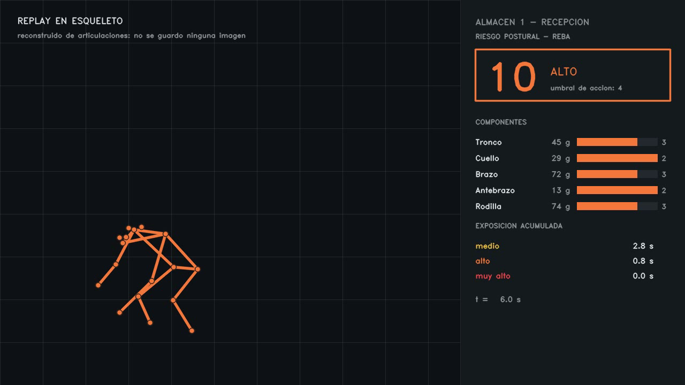

# Riesgo postural por visión

**Mide la exposición ergonómica de todos los operarios, todo el turno, contra la
norma REBA — y sin guardar una sola imagen.**



*Un incidente reconstruido meses después a partir de articulaciones. No hace falta
haber conservado el vídeo, porque el sistema nunca lo tuvo.*

---

## El problema

Los **desórdenes musculoesqueléticos son la primera causa de enfermedad laboral en
Colombia**: más del 65% de los diagnósticos reportados al Sistema General de Riesgos
Laborales, más de 3 millones de días de incapacidad al año, y cerca del 35% de las
solicitudes. Un caso calificado como enfermedad laboral pasa de **25 millones de
pesos** entre tratamiento, rehabilitación e incapacidades, y el dolor lumbar concentra
alrededor del 80% de las indemnizaciones de origen laboral.

**Cómo se mide hoy:** un ingeniero de seguridad y salud en el trabajo observa a un
operario **media hora con un portapapeles**, calcula un puntaje REBA a mano, y
extrapola esa muestra a un turno de ocho horas y a cincuenta trabajadores.

El problema no es que no sepan medirlo. El problema es que **solo pueden medir una
muestra ridícula**, y con eso se priorizan las intervenciones: qué puesto se rediseña,
a quién se capacita, dónde se gasta el presupuesto de prevención.

## Qué decide el sistema

Una cámara corriente por puesto de trabajo, y tres respuestas que hoy nadie tiene:

| pregunta | qué responde |
|---|---|
| **¿qué puesto concentra el riesgo?** | horas-hombre de exposición por nivel, ordenadas |
| **¿qué TAREA de ese puesto lo causa?** | el riesgo atribuido a cada tarea, por severidad **y** duración |
| **¿cuánto debería pesar esa carga?** | el límite en kilos según la ecuación NIOSH de levantamiento |

Y una que cambia la conversación con el cliente: **¿sirvió la capacitación?** La
exposición antes y después, medida igual las dos veces.

### El hallazgo que justifica medir por tareas

Sobre un turno real, con el puesto configurado a 12 kg y agarre regular:

| tarea | REBA | tiempo | % del riesgo del turno |
|---|---|---|---|
| agacharse al suelo a colocar | **9**, el más alto | 0,6 min | 9% |
| colocar a media altura | 4 | 3,1 min | **26%** |

**La tarea más peligrosa no es la que más daño acumula.** Quien mirara solo el pico de
REBA mandaría a rediseñar el agacharse, y el 26% del problema está en una tarea de
riesgo moderado que dura cinco veces más. Eso solo aparece cruzando severidad con
duración, y es justo lo que una observación de media hora no puede ver.

## La objeción que mata a estos sistemas, y cómo la ataca

Los sistemas de ergonomía por visión están frenados por **la objeción de privacidad
del trabajador** — hay grupos publicando alternativas con radar de ondas milimétricas
solo para no tener que poner una cámara. Un sistema que graba a los operarios no lo
aprueba ningún sindicato ni ningún comité de convivencia.

Aquí **el fotograma se destruye en la misma iteración en que se extraen las
articulaciones**, y lo único que se puede persistir son esqueletos: `(T, 17, 3)`,
articulaciones por fotograma.

No es una promesa del README. [`src/pose/extractor.py`](src/pose/extractor.py) es la
única pieza que ve imágenes y **ninguna de sus funciones devuelve, guarda ni acumula
una**, así que ningún consumidor puede persistir un fotograma aunque quiera. La imagen
de arriba es la demostración en pantalla: el incidente completo, reconstruido sin
material gráfico de nadie.

*Un matiz que conviene decir entero: calibrar el detector de carga para una planta
nueva sí necesita unos minutos de vídeo etiquetado, con una herramienta que se corre a
mano y cuyo material no sale de la máquina del cliente. El sistema en marcha no
guarda imágenes; el ajuste inicial de un modelo, sí.*

## Cómo funciona

```
vídeo  →  esqueletos  →  REBA por fotograma   →  exposición y eventos
   (el fotograma           (la norma)              por puesto de trabajo
    se destruye)                ↑
                          TCN causal: qué tarea
                          se está haciendo
```

**Dos mitades que por separado no sirven de nada.** REBA dice *cuánto* riesgo hay;
el modelo dice *de qué tarea* viene. Un puntaje sin tarea no se puede accionar —no
sabes qué rediseñar— y una tarea sin puntaje no se puede priorizar.

### La vara la pone una norma, no yo

REBA es el estándar del sector para tareas industriales dinámicas, y NIOSH es la
ecuación de levantamiento. No se inventa una métrica: se automatiza una que ya se
factura. Eso tiene una consecuencia incómoda y deliberada: **REBA geométrico es la
línea base, no el producto**. El modelo entrenado tiene que aportar algo *por encima*
de la norma, y si no lo aporta, se dice.

### Dónde aporta el modelo, y por qué ahí

Distinguir **recoger** de **colocar** es el mismo gesto en dos sentidos: un esqueleto
suelto no sabe hacia dónde va el movimiento. Una ventana temporal sí. Eso es lo que un
sistema que mira fotograma a fotograma no puede hacer, y es la tesis del proyecto.

## Los números, con su procedencia

Reconocimiento de tarea. **F1 macro**, no *accuracy*: las clases están brutalmente
desbalanceadas y un clasificador que conteste siempre lo mismo saca un *accuracy*
decente sin haber aprendido nada.

| campo | degenerado | reglas | **TCN** | rango entre pliegues |
|---|---|---|---|---|
| movimiento (andar / de pie / agachado) | 0,288 | 0,670 | **0,870** | 0,829–0,882 |
| altura de trabajo | 0,174 | 0,639 | **0,798** | 0,765–0,823 |
| **manipulación** (recoger / colocar / sostener) | 0,114 | 0,046 | **0,741** | 0,650–0,788 |
| objeto (caja / varilla) | 0,195 | 0,123 | **0,784** | 0,738–0,812 |

UW-IOM, 20 sujetos, **4 pliegues de validación cruzada por sujeto**, 10 Hz, ventana
causal de 2 s, 78.095 parámetros, 17 s de entrenamiento por pliegue en una RTX 3050.
Conjunto reservado (sujetos 11, 14, 19, 20) **sin tocar**. 2026-09-30.

**En `manipulación` el modelo pasa de 0,114 a 0,741**, que es exactamente donde estaba
previsto por escrito que tenía que ganar. Las reglas ahí sacan 0,046 porque ni lo
intentan, y eso está dicho en su código desde antes de medir.

### Y la medida que de verdad decide si el modelo sirve

El F1 no es lo que compra el cliente. Así que el informe se genera **dos veces** sobre
los mismos sujetos: una con las etiquetas verdaderas y otra con lo que predice el
modelo. El riesgo total es idéntico —REBA sale de la geometría—, así que lo único que
puede cambiar es la atribución.

| | |
|---|---|
| la tarea número 1 coincide | **sí** |
| de las 3 peores, coinciden | **3 de 3** |
| riesgo atribuido a la peor tarea | 26% real contra **23%** del modelo |

**Un modelo con 0,741 de F1 lleva a la misma decisión que la verdad.** El jefe de
planta interviene en el mismo sitio, que es el criterio de aceptación honesto — mucho
más que un umbral de F1 elegido a ojo.

### Tres cosas que se hicieron para que la comparación valga

- **Partición por sujeto, no por clip.** Casi todos los repos parten los clips al azar
  y la misma persona queda a los dos lados: el modelo memoriza cuerpos y el número
  sale inflado. Aquí ninguna persona cruza la frontera.
- **Los tres brazos predicen exactamente los mismos fotogramas.** El modelo necesita
  2 s de pasado, así que no puede predecir el principio de cada sujeto; si las reglas
  los hubieran predicho y el modelo no, la diferencia incluiría esa diferencia de
  material — y esos fotogramas son los fáciles. El arnés rechaza con error a un brazo
  que devuelva de más o de menos.
- **La red es causal**: cada convolución mira solo hacia atrás. Una que mirara el
  futuro daría mejores números y no se podría instalar.

## Lo que este sistema NO hace

- **No estima el peso de la carga por visión.** Lo declara el cliente por puesto, igual
  que el agarre y la torsión. Pedirle a una red que adivine lo que el ingeniero de SST
  sabe de memoria no es más ambicioso, es peor ingeniería: mete un error estimado donde
  había un dato exacto. ([ADR 0001](docs/adr/0001-criterios-de-riesgo-y-de-producto.md))
- **No mide la flexión del tronco con la cámara de frente.** Inclinarse hacia la cámara
  no produce ningún ángulo en la imagen: la misma postura sale naranja de perfil y
  verde de frente. Era un falso negativo de seguridad, que es lo peor que puede hacer
  un sistema así. Ahora el sistema **detecta la vista frontal y declara el tronco como
  no medible** en vez de dar un número tranquilizador.
- **No afirma que un puesto esté libre de riesgo.** Las alertas están calibradas contra
  el falso positivo —un sistema de seguridad que avisa mal se desconecta el primer día,
  y desconectado su recall es cero—, así que el informe **declara que es una cota
  inferior**.
- **No está validado fuera del laboratorio.** Todo lo medido viene de un dataset de
  laboratorio y de grabaciones propias en dos habitaciones. La pregunta de si sobrevive
  a otra planta está abierta y está escrita como tal.

## Verlo funcionando

```powershell
.\.venv\Scripts\python.exe scripts\build_demo_data.py     # genera los datos, ~3 min
.\.venv\Scripts\python.exe -m uvicorn src.api.server:app --port 8000
# http://127.0.0.1:8000/
```

Tres pantallas: el ranking de puestos, el informe de un puesto con su recomendación y
su bandeja de eventos, y el **replay en esqueleto** de cada evento. Hay además un modo
en vivo por webcam, con la cámara y el esqueleto lado a lado.

Dos cosas del panel que son decisiones y no detalles:

- **Cada turno se predice con el modelo del pliegue que NO lo vio entrenando.** La demo
  enseña predicciones sobre gente que el modelo no conoce, igual que en una planta.
  Enseñar predicciones sobre los datos de entrenamiento daría una demo más lucida y
  sería mentir.
- **Ningún recurso externo.** Una librería por CDN puede fallar justo en la toma del
  vídeo y dejar la página sin estilos. Hay una prueba que se niega a dejar entrar un
  `src` o `href` remoto.

```powershell
.\.venv\Scripts\python.exe -m pytest tests -q               # 126 pruebas
```

## El repositorio

| carpeta | qué hay |
|---|---|
| [`src/pose/`](src/pose/) | de vídeo a esqueletos. La única pieza que ve imágenes |
| [`src/baseline/`](src/baseline/) | REBA, NIOSH, el consejo de técnica y las reglas sin aprendizaje |
| [`src/models/`](src/models/) | el TCN causal que reconoce la tarea |
| [`src/load/`](src/load/) | la carga: detección, fusión con el esqueleto y pre-etiquetado con SAM |
| [`src/product/`](src/product/) | puesto de trabajo, exposición, informe por tareas |
| [`src/eval/`](src/eval/) | partición por sujeto, métricas y el arnés común a los tres brazos |
| [`src/api/`](src/api/) | FastAPI y el panel web, con modo en vivo |
| [`docs/adr/`](docs/adr/) | las decisiones de criterio, con lo que se descartó y por qué |
| [`docs/mediciones-falsas.md`](docs/mediciones-falsas.md) | **las veces que un número salió limpio y era falso** |

### Lo más útil que hay aquí

[`docs/mediciones-falsas.md`](docs/mediciones-falsas.md). Cinco veces que una medición,
una prueba o una cifra parecía buena y no lo era, con lo que la destapó: una prueba que
seguía pasando con la normalización rota, un número plausible calculado sobre el 35%
del vídeo, media hora de riesgo que no existía por un ángulo invertido, una
generalización mía que tumbó la prueba escrita para justificarla, y una comprobación
cuyo resultado tenía dos causas indistinguibles.

**Coherente no es correcto**, y de los cinco casos solo uno lo destapó un test. A dos
los destapó mirar la imagen en vez de la tabla.

## Procedencia de las cifras del problema

Las cifras de incidencia y coste vienen de los informes del Sistema General de Riesgos
Laborales y de Fasecolda sobre enfermedad laboral en Colombia. **Están pendientes de
enlazar una por una antes de publicar el repositorio**, y hasta que lo estén se citan
como orden de magnitud y no como dato auditado — que es el mismo criterio que se aplica
a todo lo demás en este proyecto.
